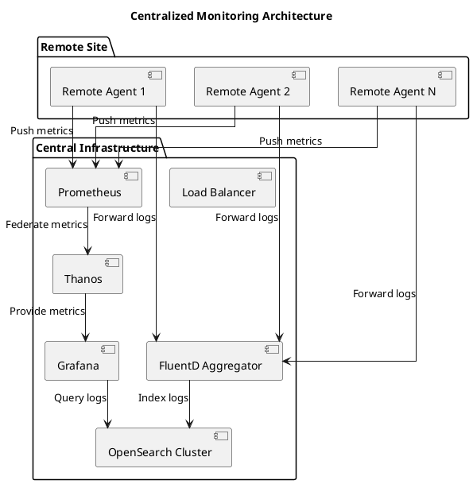

# System Architecture Overview

## High-Level Architecture

## Component Descriptions

### Remote Agents
- Lightweight collectors running on each remote system
- Responsible for:
  - Collecting system and application logs
  - Forwarding logs to the central aggregator
  - Collecting and forwarding system metrics
  - Local buffering during network issues

### Central Infrastructure

#### FluentD Aggregator
- Central log aggregation point
- Responsibilities:
  - Receive and process logs from all remote agents
  - Parse and structure log data
  - Route logs to appropriate OpenSearch indices
  - Apply retention policies

#### OpenSearch Cluster
- Distributed search and analytics engine
- Features:
  - Scalable storage for log data
  - Powerful query capabilities
  - Built-in security and access control
  - Index lifecycle management

#### Prometheus & Thanos
- Metrics collection and federation
- Components:
  - Prometheus: Time-series database for metrics
  - Thanos: Global view and long-term storage
  - Alertmanager: Alert routing and deduplication

#### Grafana
- Visualization and alerting
- Capabilities:
  - Dashboards for log and metric visualization
  - Alerting based on log patterns and metrics
  - Integration with OpenSearch and Prometheus

## Data Flow

1. **Log Collection**: Remote agents collect logs from various sources
2. **Log Forwarding**: Agents forward logs to the central FluentD aggregator
3. **Log Processing**: FluentD processes and enriches log data
4. **Storage**: Processed logs are stored in OpenSearch
5. **Metrics Collection**: System and application metrics are collected by Prometheus
6. **Federation**: Thanos provides a global view of metrics
7. **Visualization**: Grafana provides dashboards for both logs and metrics

## Security Considerations

- All communications should be encrypted (TLS)
- Authentication and authorization for all components
- Network segmentation and firewalling
- Audit logging for all access
- Regular security updates and patches
